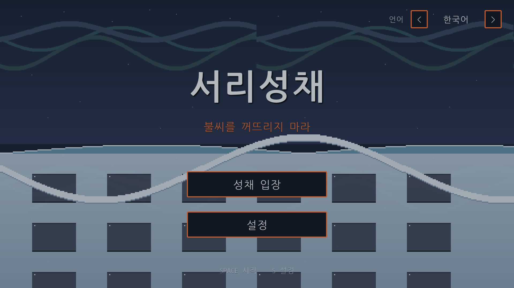
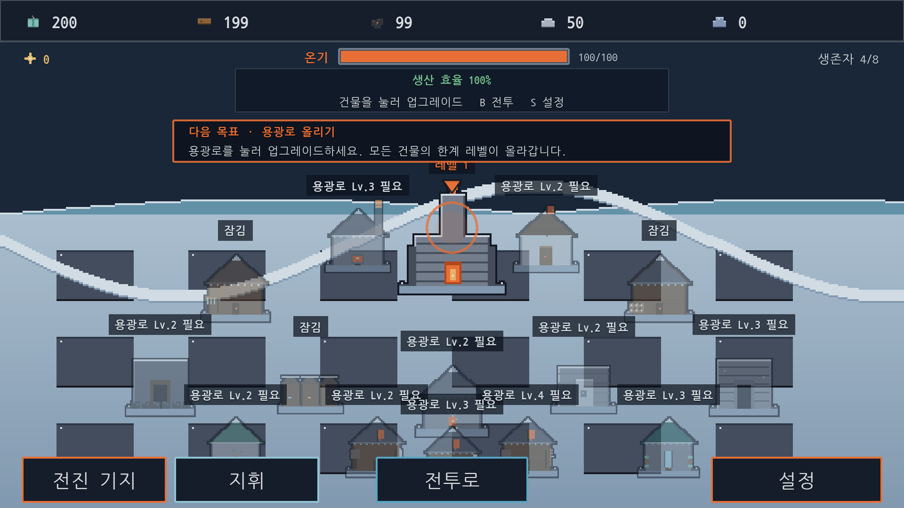
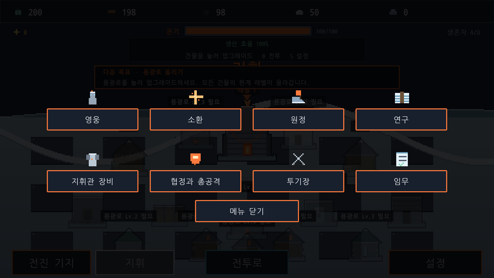
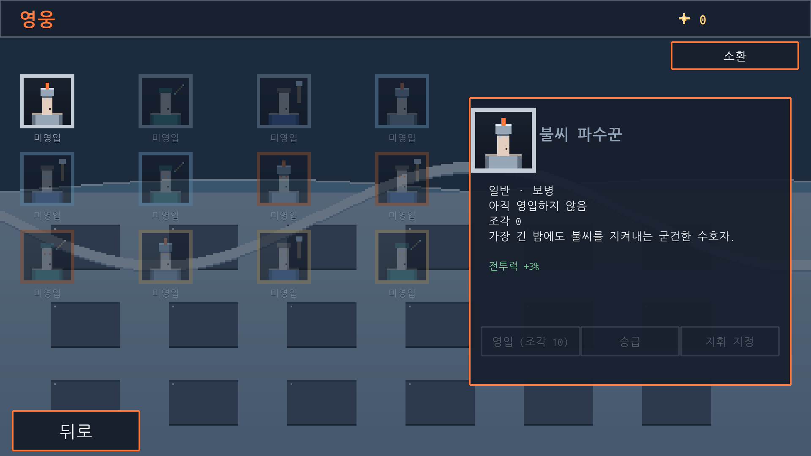
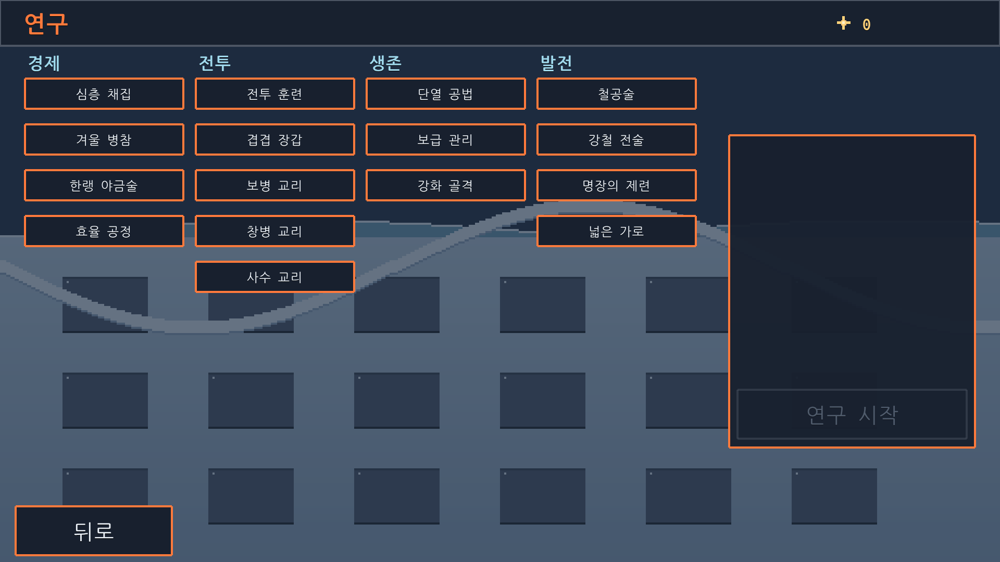
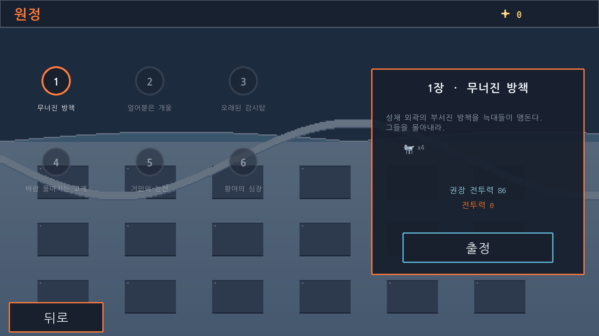

<a id="top"></a>

# 서리성채: 마지막 불씨 · Frosthold: Last Ember

> 끝나지 않는 겨울. 살아남는 방법은 단 하나 — 화로의 불씨를 꺼뜨리지 마라.
> An endless winter. One rule to survive — never let the Ember die.

**언어 / Language: [한국어](#korean) · [English](#english)**

▶ **지금 플레이 / Play now:** <https://savagemanage.github.io/open-games/whiteout/>

<p>
  
  
  
  
  
  
</p>

---

<a id="korean"></a>

## 🇰🇷 한국어

**[English 버전으로 이동 ↓](#english)**

**서리성채: 마지막 불씨**는 오리지널 세계관의 2D 픽셀아트 **혹한 생존 도시 건설 ·
방치형 전략** 브라우저 게임입니다. 세계는 영원한 겨울에 갇혔고, 당신의 정착지는
중앙의 **화로(Furnace)** 하나에 기대어 버팁니다. 목재와 석탄을 태워 온기를 지키고,
생존자를 모아 도시를 확장하고, 영웅을 소환하고, 연구를 진행하고, 병력을 길러
몰려오는 **서리 군단**과 **서리괴수**를 막아내세요.

> [!IMPORTANT]
> **오리지널 창작물 · IP 경계.** 본 게임은 혹한 생존 도시 건설 장르에서 *영감을
> 받은* **오리지널** 작품입니다. 모든 이름·세계관·아트·오디오는 이 프로젝트의
> 순수 창작물이며, **"Whiteout Survival"을 포함한 어떤 제3자**의 이름·캐릭터·
> 세력·스토리·로고·스프라이트·오디오도 사용하지 않습니다.
>
> 워크스페이스 슬러그와 GitHub Pages 경로(`packages/whiteout`,
> `savagemanage.github.io/open-games/whiteout/`)는 고정된 **배포 식별자**일 뿐 브랜드의
> 일부가 아닙니다. 게임에 담긴 인게임 제목("Frosthold: Last Ember / 서리성채:
> 마지막 불씨"), 세계관, 병종·적 이름, 아트, 오디오 등 그 무엇도 제3자 IP를
> 사용하지 않습니다. 에셋 출처는 [`assets/CREDITS.md`](assets/CREDITS.md)를
> 참고하세요.

### ✨ 무엇을 하는 게임인가

- 🔥 **불씨를 지켜라 (시그니처 온기 시스템).** 화로가 매 초 **목재와 석탄**을 태워
  온기(Warmth)를 유지합니다. 연료가 있으면 온기가 최대치까지 차오르고, 바닥나면
  온기가 식으며 방치 생산이 하한선까지 둔화됩니다.
- ⛏️ **방치형 자원 수집.** 사냥꾼 오두막·제재소·석탄 채굴장·철광이 시간이 지나며
  **식량·목재·석탄·철**을 자동 생산하고, 제련장에서 정련 자원 **강철(강철)**을
  만듭니다. 탭을 닫아도 계속 쌓입니다.
- 🏘️ **화로 게이트 도시 · 생존자 인구.** 다수의 오리지널 건물을 세우고, **생존자
  인구**를 늘려 생산 건물에 배치하면 온기·주거 만족도와 인력 수에 따라 산출이
  크게 오릅니다.
- 🦸 **영웅 · 소환(가챠).** 4단계 희귀도·3직군의 **오리지널 영웅 12명**을 결정론적
  천장 소환으로 모으고, 레벨·승급·스킬을 키워 생산과 전투를 함께 강화합니다.
- 🗺️ **원정 캠페인 · 연구 트리.** 오리지널 서사의 단계별 탐험과 4개 분기 16노드
  **연구 기술 트리**로 영구 보너스와 상위 병력 등급을 해금합니다.
- ⚔️ **병력 훈련·등급·상성과 결정론적 전투.** T1–T4 등급과 **보병 › 창병 › 사수**
  상성을 갖춘 병력으로 점점 강해지는 **서리 군단** 웨이브와 **서리괴수 총공격**을
  막아냅니다.
- 🛡️ **지휘관 장비 · 협정 · 투기장.** 6부위 장비와 문양, NPC 시뮬레이션 협정·
  투기장으로 힘을 키웁니다. 서버 없이 전부 단일 플레이입니다.
- 💾 **버전 관리 저장 · 오프라인 정산.** 진행은 `localStorage`에 저장되고, 자리를
  비운 동안의 방치 수익도 다시 접속할 때 정산됩니다.
- 🌐 **한국어 우선 · 영어 지원.** 첫 실행 시 브라우저 언어를 자동 감지하고,
  타이틀 화면과 설정에서 언제든 전환할 수 있습니다.

### 📸 스크린샷

실제로 빌드해 헤드리스 브라우저로 구동한 화면입니다. 게임은 **한국어 우선**이라
UI 전체가 한글로 그려집니다 (번들된 OFL 한글 폰트로 렌더링).

| | |
| --- | --- |
| <br>**타이틀 화면** · 한글 제목과 언어 토글 | <br>**마을 허브** · 화로 · 자원 HUD · 온기 바 |
| <br>**지휘 메뉴** · 확장 시스템 진입점 | <br>**영웅** · 12명 로스터 · 상세/스킬 |
| <br>**연구 트리** · 4개 분기 16노드 | <br>**원정 캠페인** · 단계별 탐험 지도 |

### 🧱 기술 스택

| 도구 | 역할 |
| --- | --- |
| [Phaser 3](https://phaser.io/) | 2D 게임 프레임워크 (아케이드 물리, WebAudio) |
| [TypeScript](https://www.typescriptlang.org/) | strict 모드, 타입이 지정된 소스 |
| [Vite](https://vitejs.dev/) | 개발 서버 + 프로덕션 번들링 |
| [Vitest](https://vitest.dev/) | 순수 로직 시스템 유닛 테스트 (252개 통과 / 24개 파일) |
| Python ([`tools/`](tools/)) | 오리지널 에셋 생성 (픽셀아트는 Pillow, SFX·음악은 표준 라이브러리) |

논리 해상도는 선명한 **960×540** 픽셀 캔버스로, 최근접 이웃(nearest-neighbour)
렌더링을 통해 창 크기에 맞춰 확대됩니다.

### 🚀 시작하기

**Node 22 이상**이 필요합니다 (GitHub Pages 배포 워크플로가 사용하는 버전과
동일합니다 — [`.github/workflows/deploy.yml`](../../.github/workflows/deploy.yml) 참고).

서리성채는 [open-games](../../README.md) 모노레포의 워크스페이스입니다.
의존성은 이 디렉터리가 아니라 **저장소 루트**에서 한 번만 설치합니다.

```bash
npm install       # 저장소 루트에서 실행; 모든 워크스페이스를 설치
```

이후 패키지 스크립트는 여기서 실행하거나, 루트에서 `-w packages/whiteout`을
붙여 실행합니다.

```bash
npm run dev       # Vite 개발 서버 시작 (핫 리로드)
npm run build     # 타입 체크 + dist/로 프로덕션 빌드
npm run preview   # 프로덕션 빌드를 로컬에서 미리보기
npm run typecheck # 타입 체크만 실행 (tsc --noEmit)
npm run test      # vitest 유닛 테스트 실행
```

Vite가 출력하는 개발 서버 주소(기본값 <http://localhost:5173>)를 브라우저에서
열어 주세요. 프로덕션 빌드는 `tsc --noEmit && vite build`를 실행해 `dist/`를
생성합니다.

### 🎮 플레이 방법

마우스만으로 전체를 플레이할 수 있으며, 일부 키보드 단축키가 화면 버튼을
대체합니다. 마을(Town)은 허브로서, **지휘(Command)** 메뉴에서 영웅·소환·원정·
연구·장비·협정·투기장·임무 화면으로 이동할 수 있습니다.

| 입력 | 동작 |
| --- | --- |
| **건물 클릭** | 업그레이드 패널 열기 (레벨, 다음 비용·시간, 업그레이드) |
| **생존자 표시 탭** | 인력·인구 패널 열기 (모집·배치·해제) |
| **전투 캠프 · 캠프 버튼** | 병력 훈련 패널 열기 (등급 선택 포함) |
| **지휘 메뉴** | 영웅·소환·원정·연구·장비·협정·투기장·임무 화면 열기 |
| `B` | 마을에서 **전투로** 진군 |
| `S` | 타이틀·마을에서 **설정** 열기 |
| `L` | 언어 전환 (타이틀 화면 언어 토글과 동일) |
| `Esc` | 열린 패널 닫기 · 전투 애니메이션 건너뛰기 |
| `Space` | 플레이·이어하기 (타이틀) · **마을로** 복귀 (게임 오버) |
| `R` | 전투 **재도전** (게임 오버) |

#### 핵심 루프

1. **수집 (방치).** 사냥꾼 오두막·제재소·석탄 채굴장·철광이 식량·목재·석탄·철을
   자동 생산하고, 제련장이 **강철**을 정련합니다. 탭을 닫아도 쌓이며, 자리를 비운
   시간은 다시 접속할 때 (상한과 배율이 적용되어) 정산되고 무엇을 모았는지 요약이
   표시됩니다.
2. **온기 유지 (화로).** **화로**는 매 초 목재와 석탄을 태워 온기를 유지합니다.
   연료가 있으면 온기가 최대치로 차오르고, 바닥나면 온기가 식으며 방치 생산이
   하한선까지 둔화됩니다. 화로 레벨을 올리면 최대 온기가 커지고 연료 효율도
   좋아지므로, 불씨에 투자한 만큼 두 배로 보답받습니다.
3. **확장 · 배치.** 화로가 게이트하는 여러 건물을 세우고, **생존자**를 모집해
   생산 건물에 배치하세요. 온기·주거 만족도와 배치 인력에 따라 산출이 최소 하한선
   위로 크게 올라갑니다.
4. **성장 (영웅·연구·장비).** 영웅을 소환·육성하고, 연구 트리로 영구 보너스와
   상위 병력 등급을 열고, 지휘관 장비·문양을 강화하면 모든 보너스가 공유 스탯
   번들에 누적되어 생산과 전투에 함께 반영됩니다.
5. **훈련.** 전투 캠프에서 **덫사냥꾼·명사수·선봉대**를 묶음 단위로 대기열에
   넣고, 연구로 해금한 **T1–T4 등급**을 선택하세요. 각 묶음이 훈련 시간 뒤
   완성되어 보유 병력에 합류합니다.
6. **전투 · 총공격.** 병력을 전투로 보내 점점 강해지는 서리 군단 웨이브(**서리
   늑대·파괴자·서리 거인**)와 **서리괴수 총공격**을 막아냅니다. **보병 › 창병 ›
   사수** 상성이 판정에 반영되며, 결과는 전투 시스템이 결정론적으로 계산한 뒤
   애니메이션으로 연출됩니다. 승리 시 자원 보상과 웨이브 진행을 얻고, 패배 시
   병력은 잃지만 성채는 건재합니다. 전투 HUD의 **건너뛰기**·**속도**로 진행을
   조절하세요.
7. **더 어렵게, 반복.** 웨이브를 하나 격파할 때마다 다음 난이도가 올라가며,
   마지막으로 설정된 웨이브를 격파하면 전체 캠페인 승리입니다. 일일 임무·성장
   과업·VIP·이벤트가 진행 내내 추가 보상을 제공합니다.

**설정**에서는 전체·효과음·음악 볼륨 슬라이더와 언어 토글(한국어 · English)을
제공하며 모두 `localStorage`에 저장됩니다. 두 번 눌러 확인하는 **진행 초기화**로
저장을 지우고 새 성채를 시작할 수도 있습니다.

> [!NOTE]
> **언어 설정 (한국어 · English).** 게임은 **한국어 우선**입니다. 저장된 설정이
> 없는 첫 실행에서는 브라우저 언어를 자동 감지합니다 — 선호 언어가 `ko`로
> 시작하면 한국어, 그 외에는 영어, 감지 불가 시 한국어로 되돌아갑니다. 한 번이라도
> 직접 언어를 고르면 그 선택이 저장되어 이후 항상 우선합니다. 언어는 **타이틀
> 화면 우측 상단 토글**(◀ 한국어 ▶)이나 **설정**에서 언제든 바꿀 수 있으며 모든
> 라벨이 즉시 전환됩니다.

### 🏔️ 확장 시스템

기본 방치·전투 루프 위에, 이 게임은 혹한 생존 4X/방치 장르의 **깊이**를 오리지널
이름과 아트로 재현한 여러 시스템을 갖추고 있습니다. 모든 게임 로직은 Phaser에
의존하지 않는 순수 시스템(유닛 테스트 포함)에 있으며, 씬은 마을 허브의 **지휘**
메뉴에서 열리는 얇은 화면으로 이를 보여 줍니다.

- **확장된 도시 · 생존자 인구.** 화로가 게이트하는 다수의 오리지널 건물(피난
  거처, 서리 금고, 제련장/대장간, 사절관, 온기 병동, 불씨 서고, 그리고
  보병·창병·사수 연무장)을 비용·타이머·화로 선행조건에 따라 세웁니다. **생존자
  인구**는 주거 상한을 향해 늘어나고, 이들을 생산 건물에 배치하면 만족도(온기 +
  주거) × 배치 인력에 비례해 산출이 오릅니다. **인력·인구 패널**(상단 생존자
  표시를 탭)에서 **모집·배치·전원 해제**를 할 수 있습니다.
- **자원 계층.** 기본 4자원(식량·목재·석탄·철)에 더해 정련 자원 **강철(강철)**과
  소환에 쓰이는 프리미엄 화폐 **불씨 정수(Ember Sparks)**를 다룹니다.
- **영웅 · 소환(가챠).** 4단계 희귀도, 3직군(보병·창병·사수)의 **오리지널 영웅
  12명**. 조각(파편), 천장 보장이 있는 **결정론적 시드 소환**, 영웅 레벨·성급
  승급·스킬을 갖췄으며, 지휘 영웅의 보너스는 생산과 전투에 모두 반영됩니다.
- **원정(캠페인).** 오리지널 서사의 단계별 탐험 지도. 첫 돌파 시 자원·조각·정수
  보상을 한 번 지급하고 다음 관문을 해금합니다.
- **연구 기술 트리.** 4개 분기(경제·전투·생존·발전) 16개 노드로, 선행조건과 연구
  실 레벨 게이트, 타이머를 거쳐 영구적인 타입별 보너스를 부여합니다(일부는 상위
  병력 등급을 해금).
- **지휘관 장비 · 문양.** 6부위 장비와 문양을 업그레이드 비용을 들여 강화하며,
  보너스는 공유 스탯 번들에 누적됩니다.
- **병력 등급 · 상성.** 발전 연구로 해금되는 **병력 등급 T1–T4**와 **보병 › 창병 ›
  사수** 상성 삼각형이 훈련·보유 병력·전투·저장에 일관되게 반영됩니다.
- **서리괴수 총공격 · 협정 · 투기장.** 반복 시도로 HP를 깎아내고 단계별 보상을
  주는 **서리괴수 총공격(월드 보스)**, NPC로 시뮬레이션된 **협정(연맹)**(지원으로
  타이머 단축, 협정 연구 기여), 그리고 시드 기반 NPC 사다리 **투기장**(결정론적
  결과). 서버 없이 전부 단일 플레이입니다.
- **메타 진행.** 날짜가 바뀔 때 갱신되는 **일일 임무**, 1회성 **성장 과업**,
  회전형 시간제한 **이벤트** 프레임워크, 그리고 영구 혜택의 **VIP** 등급으로
  진행 내내 추가 보상과 방치 산출 상승을 제공합니다.

### 💾 저장 · 지속성

게임은 15초 주기와 주요 행동(업그레이드, 전투, 탭 이탈) 시점에 `localStorage`로
자동 저장됩니다. 저장 데이터에는 **버전**이 있어, 손상·부재·구버전 저장은
충돌하지 않고 새 게임으로 안전하게 되돌아갑니다. 자리를 비운 동안의 방치 생산량은
로드 시 정산됩니다 (최대 오프라인 시간 상한과 오프라인 효율 배율 적용).

### 🗂️ 프로젝트 구조

```
src/
  main.ts          Phaser.Game 부트스트랩 + 씬 목록
  config/          설정 기반 튜닝 값 (Game/Building/Troop/Wave/Hero/Research/
                   Gear/Rally/Alliance/Quest/Vip/Campaign) + 에셋·씬 키
  scenes/          Boot, Preload, Title, Town, Battle, GameOver, Settings,
                   Hero, Summon, Campaign, Research, Gear, Alliance, Arena,
                   Quests (+ HubScene 베이스)
  entities/        Battler (애니메이션되는 단일 전투 유닛)
  systems/         순수 로직 시스템: ResourceStore, BuildingSystem, PopulationSystem,
                   TrainingQueue, CombatSystem, CasualtyTimeline, WarmthSystem,
                   HeroRoster, SummonSystem, CampaignSystem, ResearchSystem,
                   GearSystem, RallySystem, AllianceSystem, ArenaSystem,
                   QuestSystem, VipSystem, PremiumWallet, SaveManager,
                   GameState + AudioManager, SettingsStore
  ui/              공용 픽셀 UI 헬퍼: Menu, TrainingPanel, PopulationPanel,
                   BattleHud, UiText
  types/           공용 횡단 타입
  i18n/            한국어 우선 KO/EN 문자열 테이블 + 소형 런타임
public/assets/     오리지널 스프라이트, 배경, UI, FX, 오디오
tools/             에셋 생성기 (gen_sprites.py, gen_audio.py)
```

`systems/`의 클래스에는 **Phaser 의존성이 없어서**, 자원 계산·업그레이드 비용
공식·인구/배치 로직·훈련 대기열 타이밍·전투 계산(상성 포함)·**화로 온기
로직(WarmthSystem)**·영웅/소환/연구/장비/총공격/협정/투기장/임무/VIP 로직·저장
직렬화, 그리고 설정 로드(브라우저 언어 자동 감지 포함)가 모두 빠른 `vitest`
유닛 테스트(`src/**/*.test.ts`)로 검증됩니다 — 24개 파일에서 252개 테스트 통과.

### 🎨 에셋 재생성

모든 아트와 오디오는 [`tools/`](tools/)의 Python 스크립트가 만든 오리지널
창작물입니다. 재생성하려면:

```bash
python3 -m pip install --user Pillow   # 스프라이트 생성기의 유일한 의존성
python3 tools/gen_sprites.py           # -> public/assets/{sprites,backgrounds,ui,fx}
python3 tools/gen_audio.py             # -> public/assets/audio  (표준 라이브러리만 사용)
```

생성된 에셋은 저장소에 커밋되어 있습니다 (Phaser가 런타임에 `public/assets/`에서
로드). 출력은 결정론적이므로 재생성해도 바이트 단위로 동일한 파일이 나옵니다.
전체 파일별 출처는 [`assets/CREDITS.md`](assets/CREDITS.md)에 있습니다.

### 🌍 배포 (GitHub Pages)

서리성채는 [open-games](../../README.md) 모노레포의 일부로
<https://savagemanage.github.io/open-games/whiteout/> 에 게시됩니다.

배포는 저장소 전체를 한 번에 처리하는
[`.github/workflows/deploy.yml`](../../.github/workflows/deploy.yml)이 담당합니다.
`main`에 푸시할 때마다 모든 워크스페이스를 빌드하고, 각 `dist/`를 자기 서브패스로
수집하고, 루트 랜딩 페이지를 생성해 함께 게시합니다. 게임마다 따로 설정할 것은
없습니다. 게임 쪽에서 관여하는 것은 [`vite.config.ts`](vite.config.ts)의 프로덕션
base 경로(`/open-games/whiteout/`)뿐입니다.

### 🙌 크레딧 · 라이선스

모든 아트와 오디오는 이 프로젝트의 오리지널 창작물이며 [`tools/`](tools/)의
스크립트로 생성됩니다. 전체 파일별 출처와 라이선스는
[`assets/CREDITS.md`](assets/CREDITS.md)에 기록되어 있습니다.

라이선스는 **Apache-2.0**입니다 — [LICENSE](../../LICENSE)를 참고하세요.

<div align="right"><a href="#top">▲ 맨 위로</a></div>

---

<a id="english"></a>

## 🇬🇧 English

**[한국어 버전으로 이동 ↑](#korean)**

**Frosthold: Last Ember** is an original-world 2D pixel-art **frozen-survival
city-builder · idle strategy** browser game. The world is locked in an endless
winter and your settlement survives around a single central **Furnace**. Burn
wood and coal to hold back the cold, gather survivors to grow the city, summon
heroes, run research, raise an army, and repel the incoming **Frozen Horde** and
**Frostbeasts**.

> [!IMPORTANT]
> **Original work · IP boundary.** This is an **original** game *inspired by* the
> frozen-survival city-builder genre. All names, lore, art, and audio are
> original to this project, and it does **not** use "Whiteout Survival" (or any
> other third-party) names, characters, factions, story, logos, sprites, or
> audio.
>
> The workspace slug and GitHub Pages path (`packages/whiteout`,
> `savagemanage.github.io/open-games/whiteout/`) are only a fixed **deployment
> identifier**, not part of the brand. Nothing shipped in the build — the
> in-game title ("Frosthold: Last Ember / 서리성채: 마지막 불씨"), the lore, the
> troop/enemy names, the art, or the audio — uses any third-party IP. See
> [`assets/CREDITS.md`](assets/CREDITS.md) for full asset provenance.

### ✨ What the game is

- 🔥 **Keep the Ember alive (signature Warmth system).** The Furnace burns **wood
  and coal** every second to sustain Warmth. While fuel lasts warmth climbs to
  its max; when the stockpile runs dry warmth decays and idle production is
  throttled toward a floor.
- ⛏️ **Idle resource gathering.** The Hunters' Hut, Sawmill, Coal Pit, and Iron
  Mine passively generate **food, wood, coal, and iron** over time, and the Forge
  refines them into **Steel** — even while the tab is closed.
- 🏘️ **Furnace-gated city · survivor population.** Raise a city of original
  buildings and grow a **survivor population** you assign to producers; output
  scales with satisfaction (warmth + housing) and how many hands you staff.
- 🦸 **Heroes · summon (gacha).** Collect **12 original heroes** across four
  rarities and three classes through a deterministic pity summon, then level,
  star-up, and skill them to boost both production and combat.
- 🗺️ **Expedition campaign · research tree.** Progress a staged, original-story
  exploration map and a four-branch, 16-node **research tech tree** that unlocks
  permanent bonuses and higher troop tiers.
- ⚔️ **Troop training, tiers, counters · deterministic battle.** Field troops
  across tiers T1–T4 with the **Infantry › Lancer › Marksman** counter triangle
  to repel escalating **Frozen Horde** waves and **Frostbeast rallies**.
- 🛡️ **Chief gear · alliance · arena.** Strengthen the hold with a six-slot gear
  set plus charms, and NPC-simulated alliance and arena play — all single-player,
  no servers.
- 💾 **Versioned saves · offline reconciliation.** Progress is stored in
  `localStorage`, and idle gains earned while you were away are credited on
  return.
- 🌐 **Korean-first, English supported.** Browser language is auto-detected on
  first run, and you can switch anytime from the Title screen or Settings.

### 📸 Screenshots

Captured from a real production build driven in a headless browser. The game is
**Korean-first**, so the entire UI is drawn in Hangul (rendered with a bundled
OFL Korean font).

| | |
| --- | --- |
| <br>**Title screen** · Korean title + language toggle | <br>**Town hub** · Furnace · resource HUD · warmth bar |
| <br>**Command menu** · entry to the expanded systems | <br>**Heroes** · 12-hero roster · detail/skills |
| <br>**Research tree** · four branches, 16 nodes | <br>**Expedition campaign** · staged exploration map |

### 🧱 Tech stack

| Tool | Role |
| --- | --- |
| [Phaser 3](https://phaser.io/) | 2D game framework (arcade physics, WebAudio) |
| [TypeScript](https://www.typescriptlang.org/) | strict, typed source |
| [Vite](https://vitejs.dev/) | dev server + production bundling |
| [Vitest](https://vitest.dev/) | unit tests for the pure-logic systems (252 passing / 24 files) |
| Python ([`tools/`](tools/)) | original asset generation (Pillow for pixel art, stdlib synthesis for SFX/music) |

Logical resolution is a crisp **960×540** pixel canvas scaled to fit the window
with nearest-neighbour rendering.

### 🚀 Getting started

Requires **Node 22+** (the version the GitHub Pages deploy workflow builds with;
see [`.github/workflows/deploy.yml`](../../.github/workflows/deploy.yml)).

Frosthold is a workspace of the [open-games](../../README.md) monorepo, so
dependencies are installed once from the **repo root**, not from this
directory:

```bash
npm install       # from the repo root; installs every workspace
```

Then run the package scripts from here (or from the root with
`-w packages/whiteout`):

```bash
npm run dev       # start the Vite dev server (hot reload)
npm run build     # type-check + production build into dist/
npm run preview   # preview the production build locally
npm run typecheck # type-check only (tsc --noEmit)
npm run test      # run the vitest unit suite
```

Open the dev server URL that Vite prints (default <http://localhost:5173>). The
production build runs `tsc --noEmit && vite build` to emit `dist/`.

### 🎮 How to play

The whole game is playable with the mouse; a few keyboard shortcuts mirror the
on-screen buttons. The Town is a hub: its **Command** menu opens the Hero,
Summon, Campaign, Research, Gear, Alliance, Arena, and Quests screens.

| Input | Action |
| --- | --- |
| **Click a building** | Open its upgrade panel (level, next cost/time, Upgrade) |
| **Tap the survivor readout** | Open the workforce / population panel (recruit · assign · recall) |
| **War Camp · War Camp button** | Open the troop training panel (with tier selection) |
| **Command menu** | Open the Hero, Summon, Campaign, Research, Gear, Alliance, Arena, Quests screens |
| `B` | March **To Battle** (from the Town) |
| `S` | Open **Settings** (from the Title or Town) |
| `L` | Toggle language (same as the Title-screen language toggle) |
| `Esc` | Close the open panel · skip the battle animation |
| `Space` | Play/Continue (Title) · return **To Town** (Game Over) |
| `R` | **Retry** the battle (Game Over) |

#### The core loop

1. **Gather (idle).** The Hunters' Hut, Sawmill, Coal Pit, and Iron Mine generate
   food, wood, coal, and iron over time, and the Forge refines **Steel** — even
   while the tab is closed. Offline time is credited (capped and scaled) the next
   time you load, with a summary of what you gathered.
2. **Keep warm (the Furnace).** The **Furnace** burns wood and coal every second
   to sustain Warmth. While fuel is available warmth climbs to its max; when the
   stockpile runs dry warmth decays and idle production is throttled toward a
   floor. A higher Furnace level raises max warmth *and* makes fuel burn more
   efficiently, so investing in the Ember pays off twice.
3. **Expand · staff.** Raise the many Furnace-gated buildings and **recruit
   survivors** to assign to producers; satisfaction (warmth + housing) and
   staffing lift output well above the skeleton-crew floor.
4. **Grow (heroes · research · gear).** Summon and develop heroes, open the
   research tree for permanent bonuses and higher troop tiers, and upgrade chief
   gear and charms; every bonus stacks into one shared stat bundle that feeds
   both production and combat.
5. **Train.** Queue batches of **Trappers, Marksmen, and Vanguards** at the War
   Camp and pick a research-unlocked **tier (T1–T4)**; each batch completes after
   its training time and joins your standing army.
6. **Battle · rallies.** Send your army to repel escalating waves of the Frozen
   Horde (**Frost Wolf, Ravager, Frost Titan**) and **Frostbeast world-boss
   rallies**. The **Infantry › Lancer › Marksman** counters feed the resolution,
   which the combat system computes deterministically and then animates; on a win
   you earn rewards and advance, on a loss your army is lost but the hold stands.
   Use **Skip** and **Speed** in the battle HUD to control pacing.
7. **Repeat, harder.** Each cleared wave raises the difficulty of the next.
   Clearing the final configured wave is a full-campaign victory, while daily
   quests, growth trials, VIP, and events add rewards throughout.

**Settings** offers master / SFX / music volume sliders and a language toggle
(한국어 · English), all persisted to `localStorage`, plus a two-press **Reset
Progress** option that wipes the save and starts a fresh hold.

> [!NOTE]
> **Language (한국어 · English).** The game is **Korean-first**. With no saved
> setting, the first run auto-detects the browser language — a preferred language
> starting with `ko` opens in Korean, otherwise English, falling back to Korean
> when detection is unavailable. Once you pick a language yourself it is saved and
> always takes precedence. Switch anytime from the **toggle at the top-right of
> the Title screen** (◀ 한국어 ▶) or in **Settings**; every label updates
> instantly.

### 🏔️ Expanded systems

On top of the core idle + battle loop, the game layers several systems that
mirror the **depth** of the frozen-survival 4X/idle genre with entirely original
names and art. All game logic lives in Phaser-free, unit-tested pure systems;
the scenes are thin screens that surface them from the Town hub's **Command**
menu.

- **Expanded city · survivor population.** A larger Furnace-gated city of original
  buildings (Shelter Row, Frost Vault, Forge Hall, Envoy Hall, Warming Ward,
  Ember Archive, and the Infantry/Lancer/Marksman yards) built against costs,
  timers, and Furnace prerequisites. A **survivor population** grows toward a
  housing cap; assign survivors to producers and output scales with satisfaction
  (warmth + housing) × staffing. A **workforce panel** (tap the survivor readout)
  lets you **recruit**, **assign**, and **recall** them.
- **Resource tiers.** Beyond the base four (food, wood, coal, iron), the game adds
  a refined resource, **Steel (강철)**, and a premium currency, **Ember Sparks
  (불씨 정수)**, spent on summons.
- **Heroes · summon (gacha).** An original roster of **12 heroes** across four
  rarities and three classes (Infantry/Lancer/Marksman), with shards/fragments, a
  deterministic **seeded summon** carrying a pity guarantee, and hero
  level/star-up/skills. Lead heroes' bonuses feed both production and combat.
- **Expedition (campaign).** A staged exploration map with an original narrative;
  first-clear rewards (resources / shards / Ember Sparks) are granted once and
  unlock the next stage.
- **Research tech tree.** 16 nodes across four branches (economy / battle /
  survival / development), with prerequisites, lab-level gates, and timers,
  granting permanent typed bonuses — some of which unlock higher troop tiers.
- **Chief gear · charms.** Six gear slots plus charms with upgrade costs; their
  bonuses aggregate into the shared stat modifiers.
- **Troop tiers · counters.** Research-gated **troop tiers T1–T4** and the
  **Infantry › Lancer › Marksman** counter triangle are threaded consistently
  through training, the standing army, combat resolution, and saves.
- **Frostbeast rallies · alliance · arena.** **Frostbeast world-boss rallies**
  with HP depleted over repeated attempts and tiered rewards, an NPC-simulated
  **alliance** (members whose help shortens timers, plus alliance tech), and a
  seeded NPC-ladder **arena** with deterministic results — all single-player, no
  servers.
- **Meta progression.** **Daily quests** that reset on a day boundary, one-time
  **growth missions**, a rotating time-limited **events** framework, and
  permanent-perk **VIP** levels — all adding rewards and lifting idle output as
  you play.

### 💾 Persistence

The game auto-saves to `localStorage` on a 15-second cadence and on meaningful
actions (upgrades, battles, leaving the tab). The save is **versioned**: a
corrupt, absent, or old-version save falls back to a fresh game rather than
crashing. Idle production accrued while you were away is reconciled on load
(capped at a maximum offline window and scaled by an offline-efficiency factor).

### 🗂️ Project structure

```
src/
  main.ts          Phaser.Game bootstrap + scene list
  config/          Config-driven tuning (Game/Building/Troop/Wave/Hero/Research/
                   Gear/Rally/Alliance/Quest/Vip/Campaign) + asset/scene keys
  scenes/          Boot, Preload, Title, Town, Battle, GameOver, Settings,
                   Hero, Summon, Campaign, Research, Gear, Alliance, Arena,
                   Quests (+ a HubScene base)
  entities/        Battler (a single animated combat unit)
  systems/         Pure-logic systems: ResourceStore, BuildingSystem, PopulationSystem,
                   TrainingQueue, CombatSystem, CasualtyTimeline, WarmthSystem,
                   HeroRoster, SummonSystem, CampaignSystem, ResearchSystem,
                   GearSystem, RallySystem, AllianceSystem, ArenaSystem,
                   QuestSystem, VipSystem, PremiumWallet, SaveManager,
                   GameState + AudioManager, SettingsStore
  ui/              Shared pixel-UI helpers: Menu, TrainingPanel, PopulationPanel,
                   BattleHud, UiText
  types/           Shared cross-cutting types
  i18n/            Korean-first KO/EN string table + tiny runtime
public/assets/     Original sprites, backgrounds, UI, FX, and audio
tools/             Asset generators (gen_sprites.py, gen_audio.py)
```

The `systems/` classes contain **no Phaser dependency**, so the resource math,
upgrade-cost formulas, population/assignment logic, training-queue timing, combat
resolution (including counters), the **Furnace warmth logic (WarmthSystem)**, the
hero/summon/research/gear/rally/alliance/arena/quest/VIP logic, and save
serialization are all covered by fast `vitest` unit tests (`src/**/*.test.ts`) —
252 tests passing across 24 files.

### 🎨 Regenerating assets

All art and audio are original and produced by the Python scripts in
[`tools/`](tools/). To regenerate them:

```bash
python3 -m pip install --user Pillow   # only dependency, for the sprite generator
python3 tools/gen_sprites.py           # -> public/assets/{sprites,backgrounds,ui,fx}
python3 tools/gen_audio.py             # -> public/assets/audio  (stdlib only)
```

The generated assets are committed (Phaser loads them at runtime from
`public/assets/`). Output is deterministic, so regenerating produces byte-stable
files. Full per-file provenance is in [`assets/CREDITS.md`](assets/CREDITS.md).

### 🌍 Deployment (GitHub Pages)

Frosthold is published as part of the [open-games](../../README.md) monorepo, at
<https://savagemanage.github.io/open-games/whiteout/>.

Deployment is handled once for the whole repo by
[`.github/workflows/deploy.yml`](../../.github/workflows/deploy.yml): every push
to `main` builds every workspace, collects each `dist/` into its own subpath,
generates the root landing page, and publishes them together. There is nothing
to configure per game - the production base path in
[`vite.config.ts`](vite.config.ts) (`/open-games/whiteout/`) is the only
game-side piece.

### 🙌 Credits · License

All art and audio are original to this project and generated by the scripts in
[`tools/`](tools/). Full per-file provenance and licensing is recorded in
[`assets/CREDITS.md`](assets/CREDITS.md).

Licensed under **Apache-2.0** — see [LICENSE](../../LICENSE).

<div align="right"><a href="#top">▲ Back to top</a></div>
